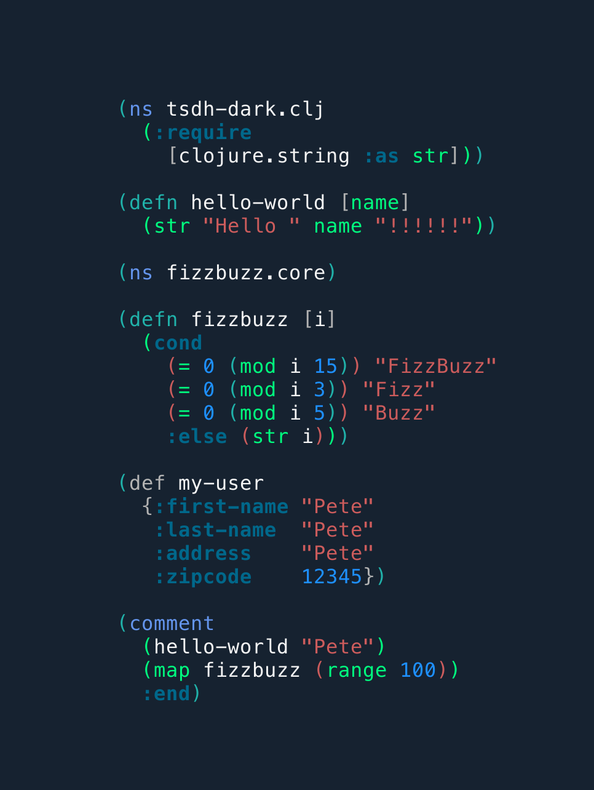

# Tsdh-Dark Vim Theme

A vim theme heavily inspired by the emacs default tsdh-dark theme.

This is optimized for (and really only tested on...) Lisps



## Installation

With vim-plug

```
Plug `fedreg/tsdh-dark.vim`
```
```
:source %
```
```
colorscheme tsdh-dark
```

